# LocalCoder Forge — Privacy-First AI Development Studio

[](https://joaquin-web.github.io/kernel-gaze-agent/)

## Overview

LocalCoder Forge is a self-contained, network-isolated AI coding environment that runs entirely within a Podman pod with kernel-enforced `--network=none` isolation. Inspired by the principles of SITU Agent but reimagined as a complete developer workspace, this tool provides a local AI pair programmer that never phones home, never sends code to external servers, and never leaks intellectual property.

Think of it as your personal code foundry — a forge where you can shape, refine, and test software without the noise of cloud dependencies, telemetry, or subscription fees. Every line of code stays on your machine, every model inference happens locally, and every decision about your project remains yours.

## Table of Contents

- [Why LocalCoder Forge](#why-localcoder-forge)
- [Architecture & Isolation Model](#architecture--isolation-model)
- [Features](#features)
- [Supported Platforms](#supported-platforms)
- [Installation & Setup](#installation--setup)
- [Configuration](#configuration)
- [Usage Examples](#usage-examples)
- [API Integration Details](#api-integration-details)
- [Internationalization & Accessibility](#internationalization--accessibility)
- [Support & Maintenance](#support--maintenance)
- [License](#license)
- [Disclaimer](#disclaimer)

## Why LocalCoder Forge

The software development landscape has been seduced by the convenience of cloud-based AI assistants. But with convenience comes a Faustian bargain: your code, your architectural patterns, and your proprietary logic are funneled through external APIs, analyzed, and often stored. For enterprises handling sensitive data, government contractors, or independent developers building the next big thing, this is an unacceptable risk.

LocalCoder Forge isn't just another tool — it's a paradigm shift. By running everything locally in a network-constrained Podman pod, we create a hermetic workspace where AI assistance exists without the possibility of data exfiltration. The kernel itself enforces the isolation; not a configuration, not a promise, but a structural reality.

## Architecture & Isolation Model

```mermaid
graph TD
    A[Podman Pod] --> B[AI Model Container]
    A --> C[Workspace Container]
    A --> D[Git Container]
    
    B --> E[Local LLM Inference]
    C --> F[Source Code Mount]
    D --> G[Local Repository Storage]
    
    H[Host Filesystem] --> C
    H --> D
    
    I[Kernel Network Stack] -->|--network=none| A
    
    style A fill:#2d2d2d,stroke:#66ff66,stroke-width:2px
    style I fill:#ff4444,color:#white
```



The architecture is deliberately spartan. Three containers share a Podman pod:
1. **AI Model Container** — Runs quantized LLMs (Llama, Mistral, CodeGemma) via llama.cpp or Ollama
2. **Workspace Container** — Contains your development tools, compilers, and linters
3. **Git Container** — Manages version control without network access

These containers communicate over a localhost interface within the pod but have absolutely zero external network access. The kernel's `--network=none` flag ensures that even if a container process is compromised, it cannot reach the outside world.

## Features

### Core Capabilities

- **Complete Network Isolation** — Kernel-enforced `--network=none` means zero egress possible
- **Local Model Execution** — Run quantized LLMs from 7B to 70B parameters without cloud dependency
- **Multilingual Code Generation** — Support for Python, Go, Rust, JavaScript, TypeScript, C++, Java, and 20+ other languages
- **Context-Aware Auto-Completion** — Understands your project structure, coding patterns, and naming conventions
- **Built-in Linting & Security Scanning** — Automated code review without data leaving the pod
- **Multi-Architecture Support** — Runs on x86_64, ARM64, and Apple Silicon

### Developer Experience

- **Responsive Terminal UI** — TUI interface optimized for tmux, screen, and native terminals
- **Configurable Model Behaviors** — Temperature, top-k, context window, and system prompts all adjustable
- **Session Persistence** — Work continues from where you left off, even after pod restarts
- **Audit Logging** — Every AI interaction is logged locally for compliance and review
- **Offline-First** — No internet required after initial model download

### Enterprise-Grade Security

- **No Telemetry** — Zero data collection, zero analytics, zero callbacks
- **MIT Licensed** — Free to use, modify, and distribute without restrictions
- **Verifiable Isolation** — Confirm network lockdown with standard Linux utilities
- **Immutable Container Layers** — Base images signed and hash-verified

## Supported Platforms

| Operating System | Status | Notes |
|-----------------|--------|-------|
| Linux (Ubuntu 22.04+) | Full Support | Primary development platform |
| Linux (Fedora 38+) | Full Support | Podman native integration |
| Linux (Debian 12+) | Full Support | Requires manual Podman installation |
| macOS (Ventura+) | Beta | Docker Desktop backend required |
| macOS (Sonoma+) | Beta | Rosetta 2 for ARM models |
| Windows (WSL2) | Experimental | Podman in WSL2 environment |
| FreeBSD 14+ | Experimental | Limited LLM model support |

## Installation & Setup

### Prerequisites

- Podman 4.9+ installed on your system
- At least 16GB RAM (32GB recommended for 13B+ models)
- 20GB free disk space for base images and models
- Linux kernel 5.14+ with user namespace support

[](https://joaquin-web.github.io/kernel-gaze-agent/)

### Quick Start

```bash
# Clone the repository
git clone https://joaquin-web.github.io/kernel-gaze-agent/

# Navigate to the forge
cd localcoder-forge

# Initialize the Podman pod (takes 2-5 minutes on first run)
./forge.sh init

# Start the development environment
./forge.sh start

# Verify network isolation
./forge.sh check-network
```

## Configuration

LocalCoder Forge uses a YAML-based configuration system that allows fine-grained control over every aspect of the AI development environment.

### Profile Configuration Example

```yaml
# ~/.config/localcoder-forge/config.yml
forge:
  name: "enterprise-secure-env"
  pod_name: "coder-pod"
  network: "none"
  
  models:
    primary: "codellama-13b-instruct-q5_k_m.gguf"
    fallback: "mistral-7b-instruct-v0.2-q4_k_m.gguf"
    context_window: 4096
    
  workspace:
    mount_path: "/home/developer/projects"
    host_path: "/path/to/your/projects"
    auto_backup: true
    backup_interval_hours: 4
    
  preferences:
    language: "en-US"
    theme: "dark-amber"
    tab_width: 4
    auto_complete_enabled: true
    lint_on_save: true
    security_scan_on_commit: true
```

## Usage Examples

### Basic AI Pair Programming Session

```bash
# Start the forge with your project
./forge.sh start --project /home/user/my-awesome-project

# Inside the pod, ask for code generation
coder@forge:~$ forge ask "Create a REST API endpoint for user authentication using FastAPI"

# The AI will generate code, explain its reasoning, and provide test examples
```

### Console Invocation Example

```bash
# One-shot code generation without entering the interactive mode
forge generate --prompt "Dockerfile for a Python 3.12 FastAPI application with Gunicorn" --language dockerfile

# Output:
FROM python:3.12-slim
WORKDIR /app
COPY requirements.txt .
RUN pip install --no-cache-dir -r requirements.txt
COPY . .
CMD ["gunicorn", "-w", "4", "-k", "uvicorn.workers.UvicornWorker", "main:app"]
```

### Multi-File Project Generation

```bash
# Generate an entire microservice skeleton
forge scaffold service-name \
  --language go \
  --framework gin \
  --with-database postgres \
  --with-metrics prometheus
```

## API Integration Details

While LocalCoder Forge is designed for offline operation, we recognize that some organizations may want to use their existing API subscriptions with enhanced privacy controls.

### OpenAI API Integration (Optional)

When enabled with appropriate network exceptions, LocalCoder Forge can route requests through OpenAI's API while still maintaining workspace isolation:

```yaml
# config.yml
external_apis:
  openai:
    enabled: false  # false by default, enable only if needed
    model: "gpt-4-turbo"
    custom_endpoint: ""  # for proxy or Azure OpenAI deployments
```

### Claude API Integration (Optional)

Similarly, Anthropic's Claude API can be configured for organizations with existing contracts:

```yaml
external_apis:
  claude:
    enabled: false
    model: "claude-3-opus-20240229"
    max_tokens: 4096
```

**Security Note:** When using external APIs, the forge creates a ephemeral network bridge that is destroyed after the request completes. No persistent network access is established.

## Internationalization & Accessibility

### Multilingual Support

LocalCoder Forge speaks your language — literally. The TUI interface supports:

- English (en-US, en-GB)
- Spanish (es-ES, es-MX)
- French (fr-FR)
- German (de-DE)
- Japanese (ja-JP)
- Chinese Simplified (zh-CN)
- Korean (ko-KR)
- Brazilian Portuguese (pt-BR)

### Accessibility Features

- **High Contrast Mode** — WCAG AAA compliant color schemes
- **Screen Reader Integration** — Works with Orca on Linux
- **Adjustable Font Sizes** — Terminal font scaling for visual comfort
- **Keyboard-Only Navigation** — No mouse required for any operation
- **Reduced Motion Mode** — Prevents terminal flickering for sensitive users

### 24/7 Customer Support

While the tool itself is offline, our support infrastructure is always available:

- **Documentation** — Comprehensive guides at our documentation portal
- **Community Forums** — Peer support with experienced users
- **Priority Email** — 4-hour response time for verified organizations
- **Telegram Group** — Live chat support for quick questions (limited to non-sensitive topics)

## License

LocalCoder Forge is released under the [MIT License](https://opensource.org/licenses/MIT).

Copyright (c) 2026

Permission is hereby granted, free of charge, to any person obtaining a copy of this software and associated documentation files (the "Software"), to deal in the Software without restriction, including without limitation the rights to use, copy, modify, merge, publish, distribute, sublicense, and/or sell copies of the Software, and to permit persons to whom the Software is furnished to do so, subject to the following conditions:

The above copyright notice and this permission notice shall be included in all copies or substantial portions of the Software.

THE SOFTWARE IS PROVIDED "AS IS", WITHOUT WARRANTY OF ANY KIND, EXPRESS OR IMPLIED, INCLUDING BUT NOT LIMITED TO THE WARRANTIES OF MERCHANTABILITY, FITNESS FOR A PARTICULAR PURPOSE AND NONINFRINGEMENT. IN NO EVENT SHALL THE AUTHORS OR COPYRIGHT HOLDERS BE LIABLE FOR ANY CLAIM, DAMAGES OR OTHER LIABILITY, WHETHER IN AN ACTION OF CONTRACT, TORT OR OTHERWISE, ARISING FROM, OUT OF OR IN CONNECTION WITH THE SOFTWARE OR THE USE OR OTHER DEALINGS IN THE SOFTWARE.

## Disclaimer

**Important Legal and Operational Notice**

LocalCoder Forge is provided as a tool for software development assistance. While we have designed it with the highest standards of privacy and security, no software system can guarantee absolute protection against all threats.

1. **No Warranty** — This software is provided "as is" without warranty of any kind, either expressed or implied. The entire risk as to the quality and performance of the software is with you.

2. **Artificial Intelligence Limitations** — The AI models used within LocalCoder Forge may generate incorrect, incomplete, or insecure code. Always review generated code before deployment. The creators and contributors assume no liability for damages arising from the use of AI-generated code.

3. **Network Isolation Verification** — While the `--network=none` flag provides kernel-level network isolation, users are responsible for verifying that no network access occurs after pod initialization. Use `forge.sh check-network` or manual inspection with `podman exec`.

4. **Compliance Responsibility** — Organizations using LocalCoder Forge must ensure their use complies with applicable laws, regulations, and internal policies. The tool does not automatically guarantee compliance with standards such as SOC 2, HIPAA, or GDPR — it provides the technical foundation, but compliance requires proper configuration and operational practices.

5. **Third-Party Content** — Model weights and base container images are obtained from third-party sources. Users should verify the integrity and legality of these components in their jurisdiction.

6. **No Data Collection** — The software contains no telemetry, analytics, or data collection mechanisms. However, we cannot guarantee that modifications made by users do not introduce such capabilities.

By using LocalCoder Forge, you acknowledge these terms and accept full responsibility for your use of the software.

---

[](https://joaquin-web.github.io/kernel-gaze-agent/)

*Forged in privacy. Built for sovereignty. Released in 2026.*